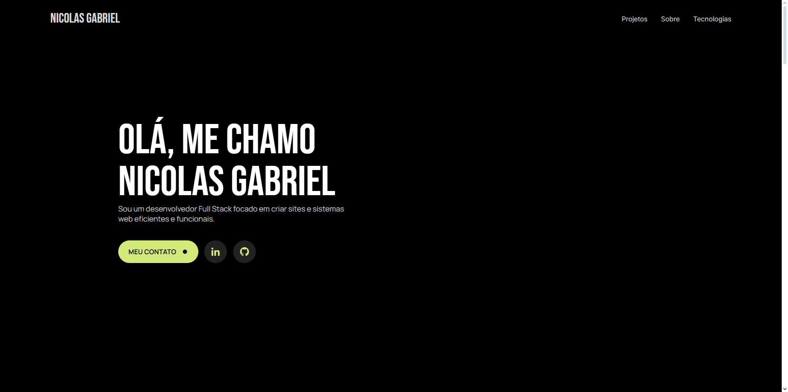
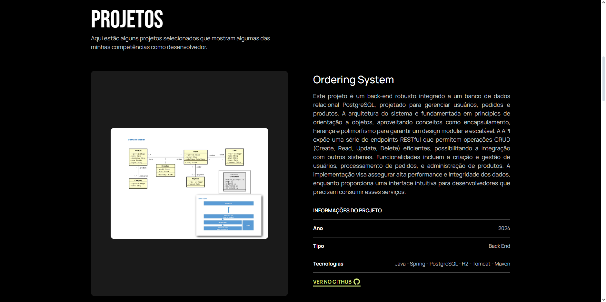
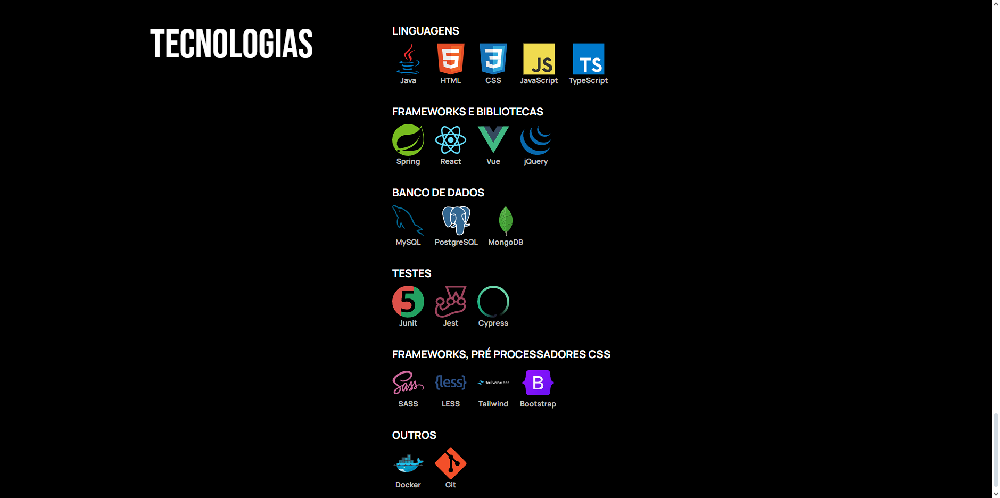
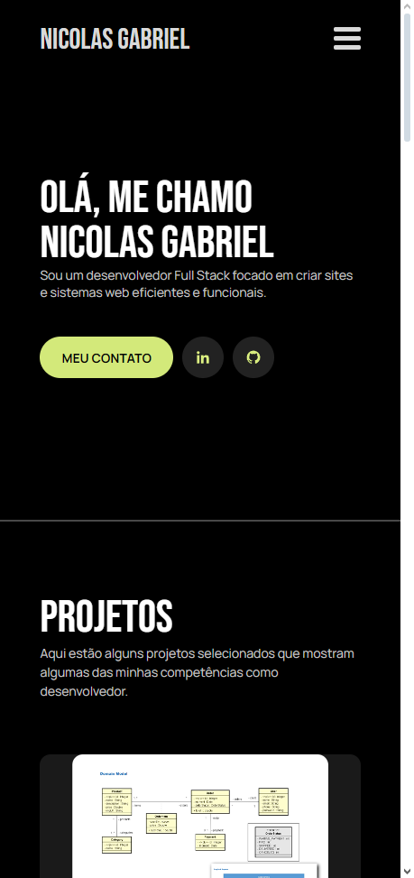
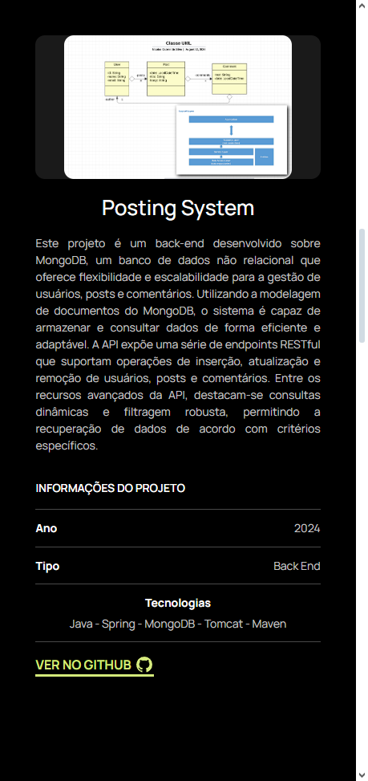
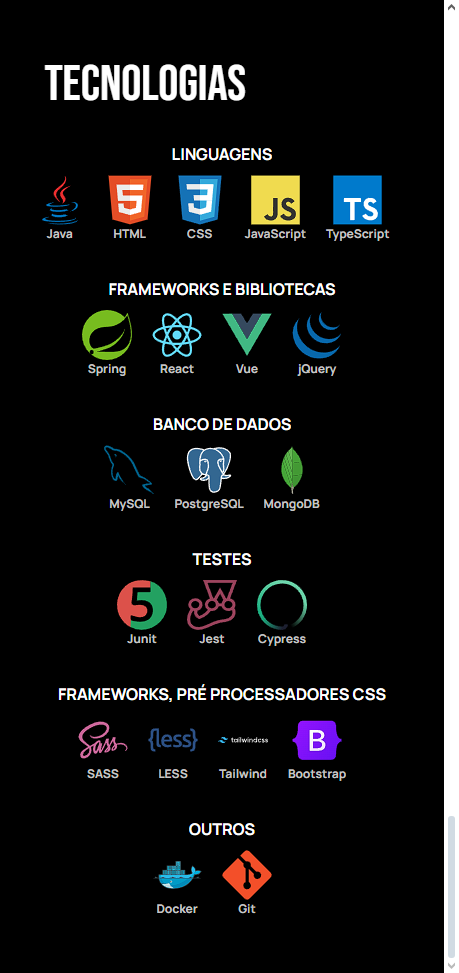

# Portfólio
[](https://github.com/nicolasgabriiel/portfolio/blob/main/LICENSE)

# Sobre o projeto

Bem-vindo ao meu portfólio! Aqui você encontrará uma seleção dos meus projetos, cuidadosamente escolhidos para demonstrar minhas habilidades técnicas e criativas. Cada projeto reflete meu domínio em diversas tecnologias e minha paixão por resolver problemas de forma inovadora.

 Explore as seções para ver como utilizo minhas competências em linguagens de programação, frameworks e outras ferramentas para transformar ideias em realidade. Estou sempre buscando aprender e aplicar novas tecnologias para melhorar a qualidade e a eficiência dos meus trabalhos.


## Design Desktop




## Design Mobile
<div style="display: flex; justify-content: center; gap: 20px;">
  
  
  
</div>

# Tecnologias utilizadas

- React
- Typescript
- SyledComponents

# Como executar o projeto

Pré-requisitos: npm

```bash
# clonar repositório
git clone https://github.com/nicolasgabriiel/portfolio

# baixar as dependências
npm install

# executar o projeto
npm run start
```

# Autor

Nicolas Gabriel da Silva

https://www.linkedin.com/in/nicolasgabriiel/
